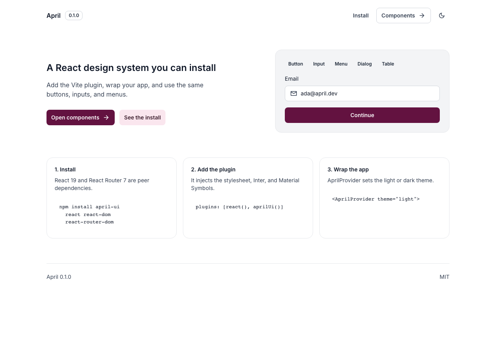

# April

April is a React design system. Install the package, add the Vite plugin, and use the components.

**Current version: 0.1.0**

Storybook lists the components. Run `npm run dev` for a local copy on port 6006.

[](https://april-ui.vercel.app/)

## Versioning

April follows [semantic versioning](https://semver.org/).

| Bump | When it happens | What you do |
| --- | --- | --- |
| Patch `0.1.x` | Bug fixes. Props and markup stay the same. | `npm update april-ui` |
| Minor `0.x.0` | New components or optional props. Existing usage keeps working. | `npm update april-ui` |
| Major `x.0.0` | A prop, component name, or plugin option changes in a way that breaks existing apps. | Read the release notes, then install that major on purpose. |

`0.x` releases can still change between minors. Pin the version when you need a fixed look:

```bash
npm install april-ui@0.1.0
```

Check what an app is running:

```bash
npm ls april-ui
```

```tsx
import { version } from 'april-ui'

console.log(version) // "0.1.0"
```

The Vite plugin also writes the release into the page:

```html
<meta name="april-ui-version" content="0.1.0" />
```

## Integrate

Peer dependencies: `react` and `react-dom` 19, and `react-router-dom` 7 (sidebar and menu options use `Link` and `NavLink`). Vite is only needed for the plugin.

### 1. Install

```bash
npm install april-ui react react-dom react-router-dom
```

### 2. Add the plugin

```ts
// vite.config.ts
import { defineConfig } from 'vite'
import react from '@vitejs/plugin-react'
import { aprilUi } from 'april-ui/vite'

export default defineConfig({
  plugins: [react(), aprilUi()],
})
```

`aprilUi()` injects `april-ui/styles.css`, Inter, and Material Symbols. Icons are symbol names (`"add"`, `"mail"`, `"close"`), passed as strings.

| Option | Default | Effect |
| --- | --- | --- |
| `injectStyles` | `true` | Adds the April stylesheet |
| `injectFonts` | `true` | Adds Inter and Material Symbols |

```ts
aprilUi({ injectFonts: false })
```

### 3. Wrap the app

`AprilProvider` sets `data-theme` on `<html>` (`"light"` or `"dark"`).

```tsx
import { AprilProvider } from 'april-ui'
import { BrowserRouter } from 'react-router-dom'
import { createRoot } from 'react-dom/client'
import { App } from './App'

createRoot(document.getElementById('root')!).render(
  <BrowserRouter>
    <AprilProvider theme="light">
      <App />
    </AprilProvider>
  </BrowserRouter>,
)
```

### 4. Use a component

```tsx
import { Button, TextInput } from 'april-ui'

export function App() {
  return (
    <>
      <TextInput label="Email" placeholder="ada@april.dev" leadingIcon leadingIconName="mail" />
      <Button label="Continue" leadingIcon={false} trailingIcon={false} />
    </>
  )
}
```

### Without Vite

Import the stylesheet once, and load Inter plus Material Symbols yourself:

```tsx
import 'april-ui/styles.css'
```

```html
<link rel="stylesheet" href="https://fonts.googleapis.com/css2?family=Inter:wght@400;500;600;700&family=Material+Symbols+Outlined:opsz,wght,FILL,GRAD@20..48,400,0..1,0&display=swap" />
```

## Scripts

| Script | What it does |
| --- | --- |
| `npm run site` | Landing page on port 5173 |
| `npm run dev` | Storybook on port 6006 |
| `npm run build` | Library build in `dist/` |
| `npm run typecheck` | `tsc --noEmit` |
| `npm run build-storybook` | Static Storybook in `storybook-static/` |

The example in `examples/vite` consumes the built package the same way an app would. The `file:` link sits beside this repo's own React, so the example Vite config dedupes `react` and `react-router-dom`.

## Publish surface

| Import | Use |
| --- | --- |
| `april-ui` | Components, `AprilProvider`, and `version` |
| `april-ui/vite` | `aprilUi()` Vite plugin |
| `april-ui/styles.css` | Stylesheet, if you are not using the plugin |
